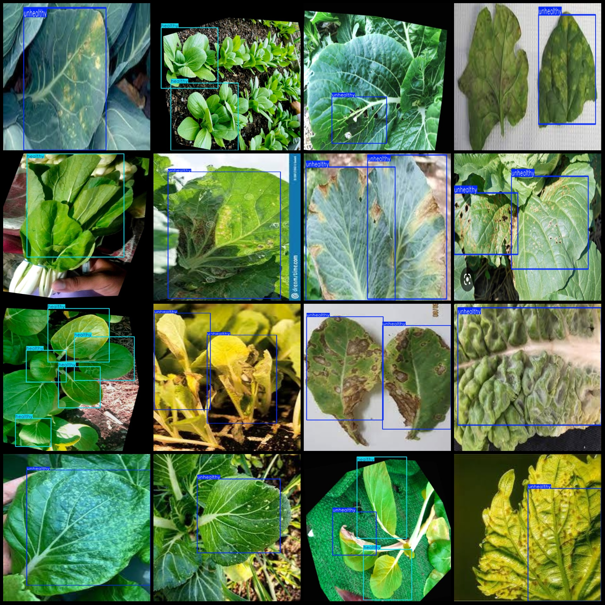
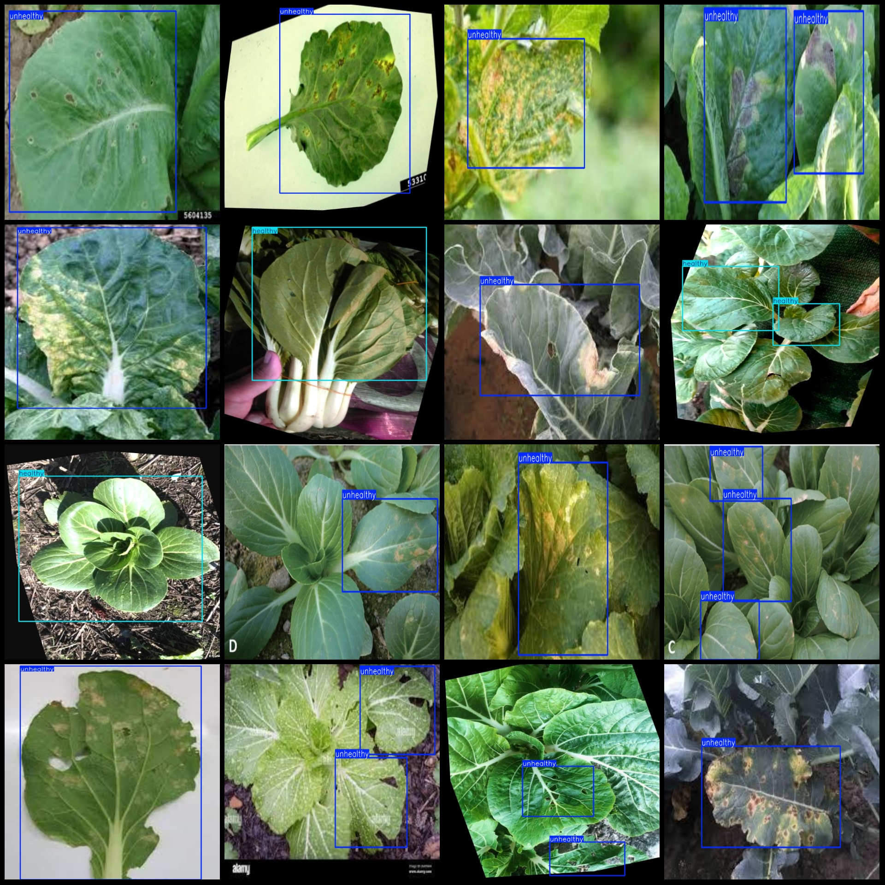

# Xiaocai Banlei Yingwei Bingzhuang Kangzheng Tongjia He Shuju Ceshi Dushushu JPG 1863 Zhang 2 Categorization

Note: The dataset includes enhancements such as rotations.
Dataset format: Pascal VOC format + YOLO format (without split path in the txt file, only containing JPG images and corresponding VOC format xml files and YOLO format txt files).
Number of images (JPG file count): 1863
Number of annotations (xml file count): 1863
Number of annotations (txt file count): 1863
Number of categories: 2
Annotation category names (note that the order of categories in the YOLO format does not correspond with this, but is based on the labels folder's classes.txt): ["healthy","unhealthy"]
Boxes per category:
Healthy boxes = 802
Unhealthy boxes = 1984
Total boxes = 2786
Number of images per category:
Healthy images = 378
Unhealthy images = 1511
Image resolution: Multiple resolution images, such as 640x640, 640x960, etc.
Annotation tool used: labelImg
Annotation rules: Draw rectangular boxes for categories
Important Notice: The dataset does not have separate training, validation, and test sets to be divided.
Special Declaration: This dataset does not guarantee the accuracy of models or weight files trained on it.
Image Preview:
Annotation Example:

## Images

Here is a pay link on Stripe ( https://buy.stripe.com/3cs8yP7sY87d0vu9AB ). Please contact me lonlonago@foxmail.com after funding $89, and I will send you a complete data files , thank you!

